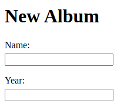

## Before exercises: prepare your workstation

To write HTML (as with any other programming language) you can use a text editor.
To *execute* HTML files you open them in a web browser (double-click should work).
You can also use more sophisticated IDEs (Integrated Development Environment).

You can use any editor or IDE you want.
In particular, I use [Sublime Text](https://www.sublimetext.com/), which is a text editor with several features that support the development of programs and systems.

We can suggest the use of [VS Code editor](https://code.visualstudio.com/download) and its [Live Server extension](https://marketplace.visualstudio.com/items?itemName=ritwickdey.LiveServer).
This extension automatically reloads the web page at the same time when you code it.
You can see a tutorial on how to use the Live Server [here](https://www.youtube.com/watch?v=T0SInJ7Eo8M)

Finally we also suggest the use of [PhpStorm](https://www.jetbrains.com/phpstorm/), a JetBrains PHP, HTML and JavaScript IDE.
In this course we are going to see PHP, HTML and JavaScript; PhpStorm is built specifically to support this technologies.
Nevertheless, any good editor or IDE is going to work with these technologies.

We do not force you which tools you want to use.
We suggest you to find an editor that suits you and learn it well: *The editor should be an extension of your hand...* (From 'The Pragmatic Programmer' by Andrew Hunt and Davit Thomas)

## Exercise: write a form

During this course you will build a music library web application.
To start this (big) project, you first need to build a form that receives the input from users.
This form will receive data of a music album.
For every album, the form should ask a user for:

* Name of the album: text
* Release year: number
* Artist: selected from a list of options
* Type: single (single song), EP (not enough to be considered a full album), album
* Description: text area
* Tracks: text, max 10

Use [w3school](https://www.w3schools.com/html/html_forms.asp) for references about form inputs.
There are more HTML tag that can be used with forms that are not input: *hint* [textarea](https://www.w3schools.com/tags/tag_textarea.asp).
*Which other tags can be used*

Use the different HTTP methods and see how they differ.
*Which method should be used in this case?*

Here is an example of part of the form:

*Why does the form not look like the example image?*

## Exercise: add style

Now that you have your first form, it needs some style.
You can use the Chrome dev tools to see your changes right away.
You can also check the [w3school css tutorial](https://www.w3schools.com/Css/).

You can inline the style in the HTML or write an external file.
*Why should you not add style in HTML element attributes?*

If you feel particularly interested, you could try [bootstrap](https://getbootstrap.com/).
